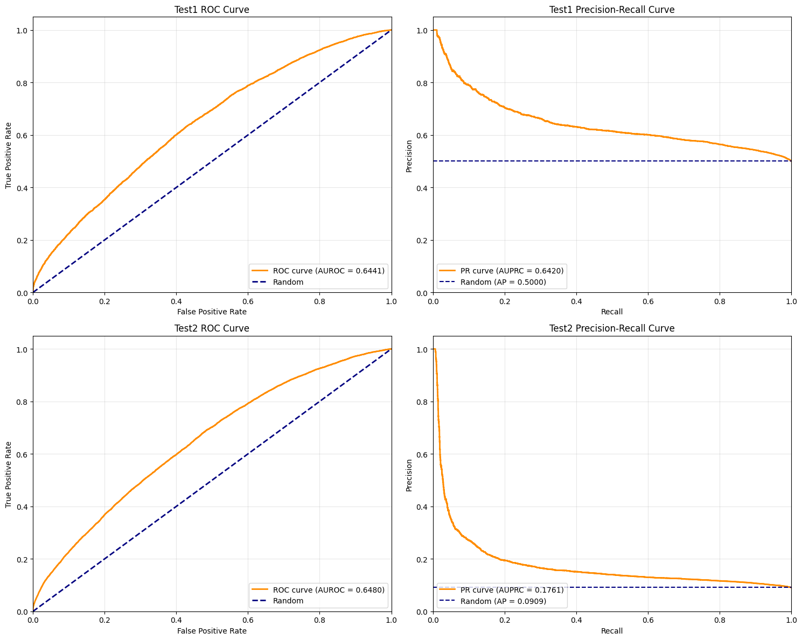
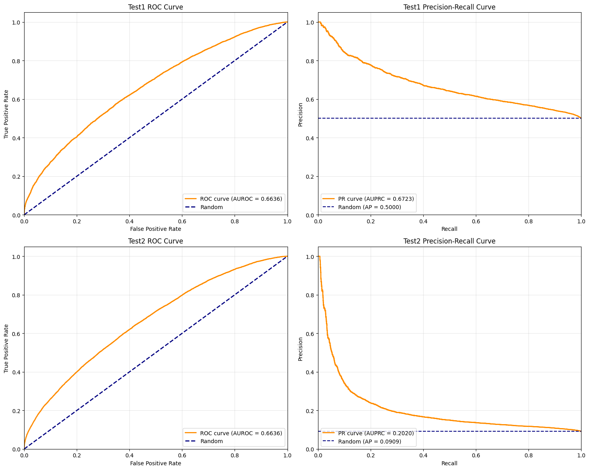

# Improving PPI Prediction with ESMC-derived Features

戴佳文，齐奕婷，王安瑞

---

## 1. Feature Extraction

- Utilized ​**ESMC**​ for protein sequence embedding
    - **ESM Cambrian** focuses on creating representations of the underlying biology of proteins.
    - Old methods use biological annotations or only protein sequences
- Technical Details:
    - Input: Protein sequences from the `b4ppi` dataset
    - Model: ESM-C pre-trained transformer
    - Output: Embeddings with shape $[L+2, 960]$, where $L$ represents sequence length and 960 is the embedding dimension.
---
## 2. Data Processing

To enable downstream classification, we explored multiple pooling strategies to transform variable-length embeddings [L, 960] into fixed-size representations [960].

---

### Initial Approach: average pooling
- Applied ​**average pooling**​ along the sequence dimension `L+2` to:
  - Handle variable-length inputs uniformly
  - Reduce computational complexity (the embedding matrix is too big)
  - Preserve channel-wise information
- Resulting compressed embedding: `[1, 960]` per protein
- Lose important positional and structural information

### max pooling
---


### Improved Approach: Masked Autoencoder (MAE)
- Length Standardization = 1502
    - Pad shorter sequences with zeros (`[PAD] = 0`)
    - Truncate longer sequences
    - 75% mask
- Problems:
  - data with small variances 0.0002-0.001 and small loss ----> multiply a scale_factor
  - mask padding positions ----> calculate the loss only for non-padding positions

---


---
### Key Improvement:  
- Added ​**padding position markers**​ for each protein sequence  

```python
return {
    "seq": seq.clone(),                # (max_len, 960)
    "padding_start": seq_len            # int
}
```
- Modified masking to ​only operate on **non-padding regions**.
  - 50% mask
---


---

### other modifications:  
- We first concatenated the two features and then applied compression; because the data volume was too large, we truncated the length of the concatenated protein embeddings to 2000.
- Use the CLS token added by ESMC as the compressed embedding.


---
## Downstream Supervised Learning Models

We evaluated multiple classification algorithms to determine the optimal approach for PPI prediction.

- **Dataset Characteristics**: 
  - Test1 dataset is a balanced dataset with 50% positive and 50% negative samples.
  - Test2 dataset presents a realistic challenge with 9.09% positive and 90.91% negative samples, closely mimicking real-world PPI prediction scenarios
---

### L2-cos Method

| Similarity      | Dataset | Best AUC | k Value |
|-----------------|---------|----------|---------|
| **L2**          | Test1   | **0.5547** | 5       |
| **L2**          | Test2   | **0.5718** | 20      |
| **Cosine**      | Test1   | 0.5330   | 5       |
| **Cosine**      | Test2   | 0.5676   | 20      |


- High similarity between proteins does not necessarily imply that they have a PPI.

---

### Logistic Regression

1. ​**As baseline**: Tests linear separability of MAE features
2. ​**Computational efficiency**: 
   - Fast training (compared to kernel methods/DL)
   - Easy hyperparameter tuning (e.g., regularization strength `C`)
3. ​**Explainability**: Direct biological interpretation of feature contributions

| Method             | Dataset | AUROC    |
|--------------------|---------|--------|
| **L2 Similarity**   | Test1   | 0.5547 |
| **L2 Similarity**   | Test2   | 0.5718 |
| **Logistic Regression** | Test1   | **0.6182** |
| **Logistic Regression** | Test2   | **0.6500** |


- Fail to capture complex nonlinear interactions between features, behaves poorly on PPI task

---

### Support Vector Machine (SVM)
* Finds optimal decision boundary with regularization
* ​Use different kernels to capture non-linearities: 
  ```python
  "svm__kernel" : ['linear', 'poly', 'rbf', 'sigmoid']
  # Handles linear/nonlinear cases```
* Effective in feature-rich, sample-limited scenarios

| Method               | Dataset | AUROC    |
|----------------------|---------|--------|
| **Logistic Regression** | Test1   | 0.6182 |
| **Logistic Regression** | Test2   | **0.6500** |
| **SVM**               | Test1   | **0.6285** |
| **SVM**               | Test2   | 0.6201 |

---
### XGBoost
**Nonlinear feature interactions**: 
   - Discovers complex patterns in 960-D MAE space


| Method               | Dataset | AUROC  |
|----------------------|---------|--------|
| **Logistic Regression** | Test1   | 0.6182 |
| **Logistic Regression** | Test2   | **0.6500** |
| **XGBoost**           | Test1   | **0.6441** |
| **XGBoost**           | Test2   | 0.6480 |
---

### Multi-Layer Perceptron (MLP)
1. The encoder of MAE is essentially a multi-layer fully connected structure, and using MLP as the downstream classification layer can naturally connect. The encoder and MLP can be merged into a large end-to-end model.
2. Captures higher-order interactions than XGBoost
3. A unified backpropagation pipeline can be useful to fine-tune both the MAE encoder and MLP

---

**Reference:** "Pitfalls of machine learning models for protein–protein interaction networks"


*Figure 1: Performance comparison between functional genomic (FG) based XGBoost and sequence-based Siamese RNN from literature on Test1 dataset.*

---


*Figure 2: XGBoost performance using mean pooling aggregation of ESM-C embeddings.*

---


*Figure 3: XGBoost performance using masked autoencoder (MAE) of ESM-C embeddings.*

---

.png)

---
## Conclusion

- **Competitive Performance**: Our MAE-based approach demonstrates competitive performance against the established FG-based XGBoost baseline from literature
- **Model Selection**: XGBoost outperforms other traditional ML classifiers (Logistic Regression, SVM)

