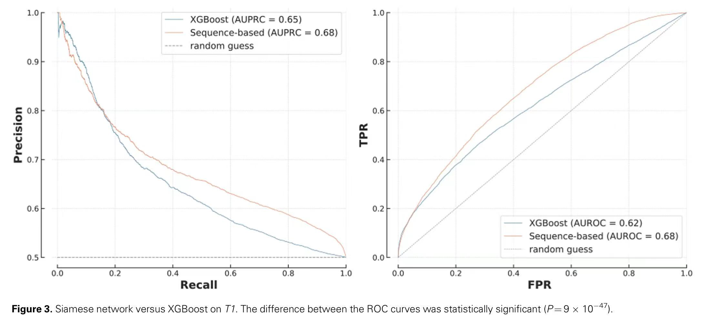
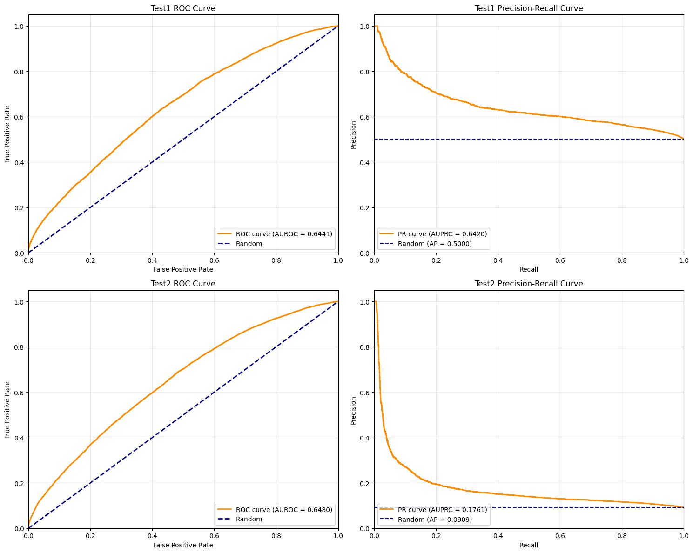
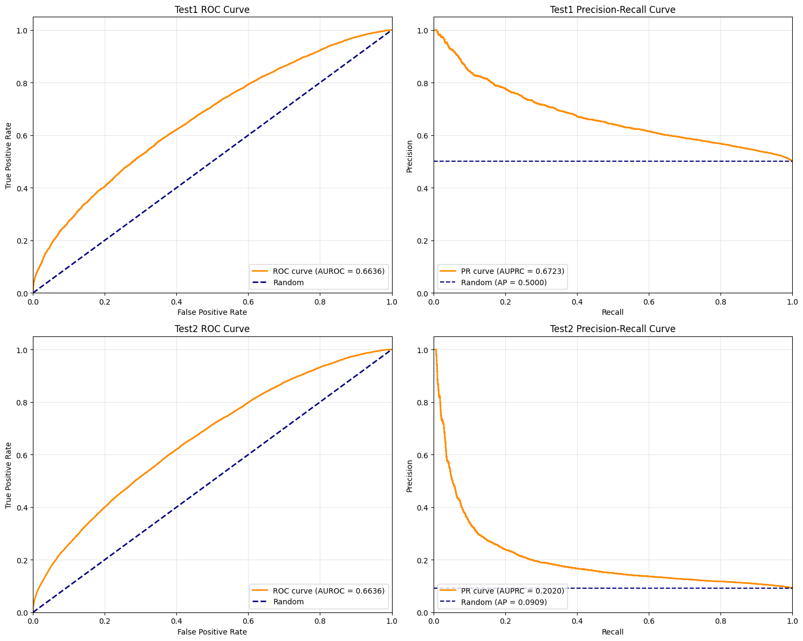

# Weekly Progress Report: Protein-Protein Interaction (PPI) Prediction

## 1. Methodology and Implementation

### 1.1 Feature Extraction (Stage 1)
We implemented protein sequence embedding using the ESM-C encoder as our primary feature extraction method.

**Technical Details:**
- Input: Protein sequences from the `b4ppi` dataset
- Model: ESM-C pre-trained transformer
- Output: Embeddings with shape [L, 960], where L represents sequence length and 960 is the embedding dimension
- Status: **Completed**

### 1.2 Dimensionality Reduction (Stage 2)
To enable downstream classification, we explored multiple pooling strategies to transform variable-length embeddings [L, 960] into fixed-size representations [960].

#### 1.2.1 Mean Pooling Approach
Our initial implementation used simple mean pooling across the sequence length dimension.

**Results:**
- Performance: Suboptimal classification accuracy
- Observation: Loss of important positional and structural information

#### 1.2.2 Masked Autoencoder (MAE) Approach
We developed a masked autoencoder architecture to learn more informative protein representations.

1. **Input** $\to$ linear → mask-out → positional add
2. **MHSA(Multi-Head Self-Attention) + FFN(Feed-Forward Network)** layers over only visible tokens
3. **Output** $\mathbf{H}\in\mathbb{R}^{B\times L_{\rm vis}\times E}$
4. **Pooling & projection** yield the final $(B,960)$ representation

- Performance: Significant improvement over mean pooling

### 1.3 Downstream Classification (Stage 3)
We evaluated multiple classification algorithms to determine the optimal approach for PPI prediction.

**Implemented Classifiers:**
1. **Logistic Regression** - Baseline linear classifier
2. **Support Vector Machine (SVM)**
3. **XGBoost**: Slightly outperformed XGBoost **using functional genomic(FG) annotations**  from "Pitfalls of machine learning models for protein–protein interaction networks"
   - Status: **Completed**
4. **Multi-Layer Perceptron (MLP)**
   - Status: **Currently implementing**

## 2. Current Results and Performance

### 2.1 Benchmark Comparison
We systematically evaluated our approach against established baselines using multiple test scenarios from the literature.

#### 2.1.1 Literature Baseline Performance
**Reference:** "Pitfalls of machine learning models for protein–protein interaction networks"

*Figure 1: Performance comparison between functional genomic (FG) based XGBoost and sequence-based Siamese RNN from literature on Test1 dataset.*

#### 2.1.2 Our Approach: ESM-C Embeddings with Traditional Pooling

*Figure 2: XGBoost performance using mean pooling aggregation of ESM-C embeddings.*

#### 2.1.3 Our Approach: ESM-C Embeddings with MAE

*Figure 3: XGBoost performance using masked autoencoder (MAE) of ESM-C embeddings.*

### 2.2 Performance Analysis

**Key Findings:**
- **Competitive Performance**: Our MAE-based approach demonstrates competitive performance against the established FG-based XGBoost baseline from literature
- **Model Selection**: XGBoost outperforms other traditional ML classifiers (Logistic Regression, SVM)
- **Dataset Characteristics**: Test2 dataset presents a realistic challenge with 9.09% positive and 90.91% negative samples, closely mimicking real-world PPI prediction scenarios

### 2.3 Limitations and Current Challenges

- Our current approach shows a performance gap compared to the sequence-based Siamese RNN baseline from literature

- **Class Imbalance**: The severe imbalance in Test2 (9.09% positives) presents significant challenges for model training and evaluation, requiring specialized techniques for handling imbalanced datasets

## 3. Next Steps

1. Complete MLP Implementation
2. MAE Optimization
4. Extended Baseline Comparisons

We are looking forward to your comments and recommendations on our current direction and any recommendations for how we might improve or expand the course project.

  
