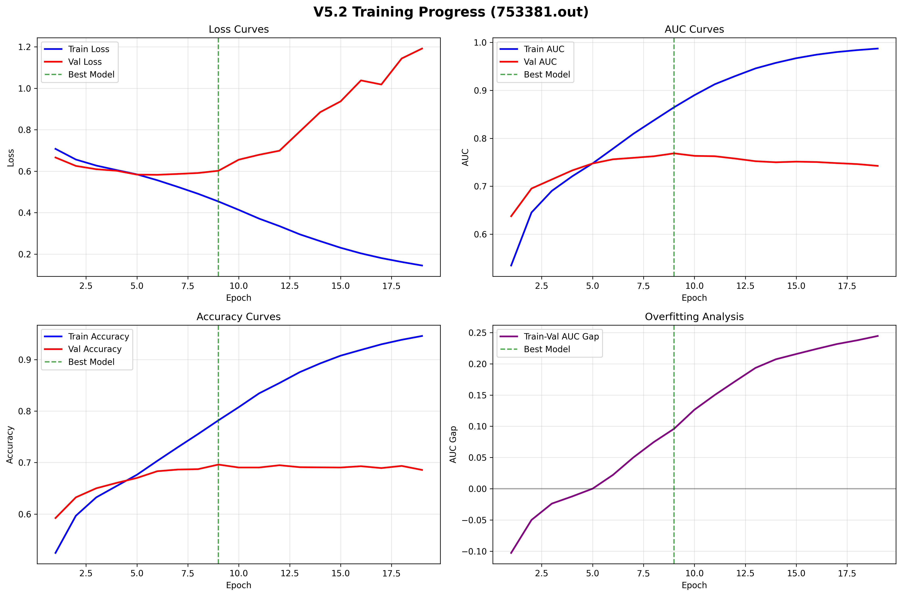
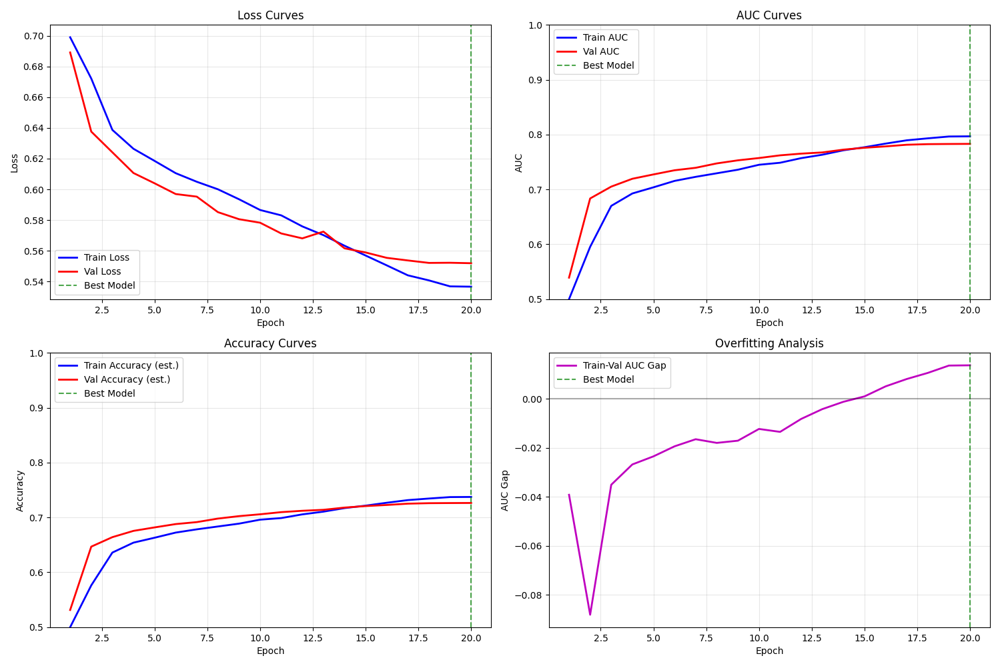

# Weekly Progress Report: Protein-Protein Interaction (PPI) Prediction

## 1. Methodology and Implementation

Implement two piplines for classification

### 1.2.1 Pretrained MAE → Cross-Attention → MLP

| Stage | What it does | Tensor shapes (batch = *B*) | Why it's needed |
|-------|--------------|------------------------------|-----------------|
| **v2 MAE encoder** (frozen) | • Projects every 960-dim residue embedding to 512-dim (**`self.embed`**) and adds positional encodings. • Runs a 4-layer Transformer encoder. • *We stop here.* | **input** $(B, L, 960)$ **output** $(B, L, 512)$ | Gives a contextualised 512-dim hidden state for **each** residue. (The original `forward()` continues on to masking, decoding and a 960-dim "compressed" vector, but we bypass that part.) |
| **Siamese sharing** | The **same** frozen MAE processes protein A and protein B independently ⇒ two sequences of hidden states: $tok_a∈ℝ^{B×L_a×512}$, $tok_b∈ℝ^{B×L_b×512}$. | $(B, L_a, 512)$ $(B, L_b, 512)$ | "Siamese" weight-sharing keeps the representation space consistent for both partners while halving the parameter count. |
| **InteractionCrossAttention** | • Adds one learnable `[CLS_int]` token (shape $(1,1,512)$). • Concatenates `[CLS_int]` + $tok_a + tok_b$ ⇒ $(B, L_a+L_b+1, 512)$. • Runs 2 cross-attention Transformer layers so that the `[CLS_int]` position can attend to *all* residues from **both** proteins and capture their joint signal. • Returns the final `[CLS_int]` vector, $z_{int}∈ℝ^{B×512}$. | input $(B, L_a, 512)$ + $(B, L_b, 512)$ output $(B, 512)$ | Lets every residue from protein A talk to every residue from protein B in a single attention pool, then distils the interaction into one 512-dim vector. |
| **MLP head** | Maps $512 → 256 → 64 → 1$ with GELU + LayerNorm + dropout, producing the logit for "does this pair interact?". | input $(B, 512)$ output $(B,)$ | A light-weight classifier trained from scratch on PPI labels. |

### 1.2.2 Encoder → Concatenation → MLP

| Stage | What it does | Tensor shapes (batch = *B*) | Why it matters |
|-------|--------------|------------------------------|----------------|
| **Protein Encoder** (Average-Pooling ➜ Linear 256 ➜ LN ➜ ReLU ➜ Dropout) | 1. Builds a single fixed-length embedding for **each protein**. 2. Uses a mask to average-pool the variable-length 960-dim residue vectors, then projects the result down to 256 dims and normalises it. | **Input** A $(B, L_a, 960)$ **Input** B $(B, L_b, 960)$ **Output** $enc_a$, $enc_b$ $(B, 256)$ | Converts raw residue features into compact, comparable protein-level vectors; removes sequence-length variance so downstream layers see a fixed size. |
| **Concatenation** | Stacks the two 256-dim protein vectors to form one joint representation. | **Input** $enc_a$, $enc_b$ $(B, 256)$ → **Output** $(B, 512)$ | Places information about both partners side-by-side so the next block can model pairwise patterns. |
| **Interaction MLP Head** (Linear $512→256$ ➜ LN ➜ ReLU ➜ Dropout ➜ Linear $256→128$ ➜ LN ➜ ReLU ➜ Dropout ➜ Linear $128→1$) | Learns nonlinear relations between the two proteins and produces the final interaction logit. | **Input** $(B, 512)$ **Output** $(B, 1)$ | Acts as a classifier that maps the combined encoding to "interact / not interact"; depth + non-linearities let it capture complex compatibility cues. |

## 2. Results and Performance

**Table 1: Comparative AUROC performance across balanced and imbalanced test datasets**

| **Method** | **Test1 AUROC** | **Test2 AUROC** |
|------------|------------------|------------------|
| Sequence-based Model(from literature) | 0.68 | -- |
| Pipline 1 | 0.7050 | 0.7072 |
| **Pipline 2** | **0.7283** | **0.7242** |

**Figure 1: Pipline 1 training progress**

**Figure 2: Pipline 2 training progress**
  
